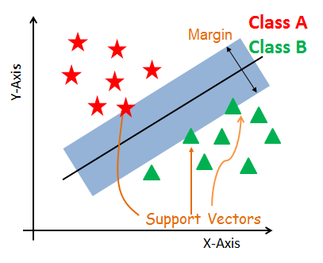
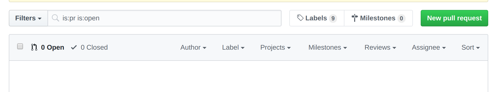
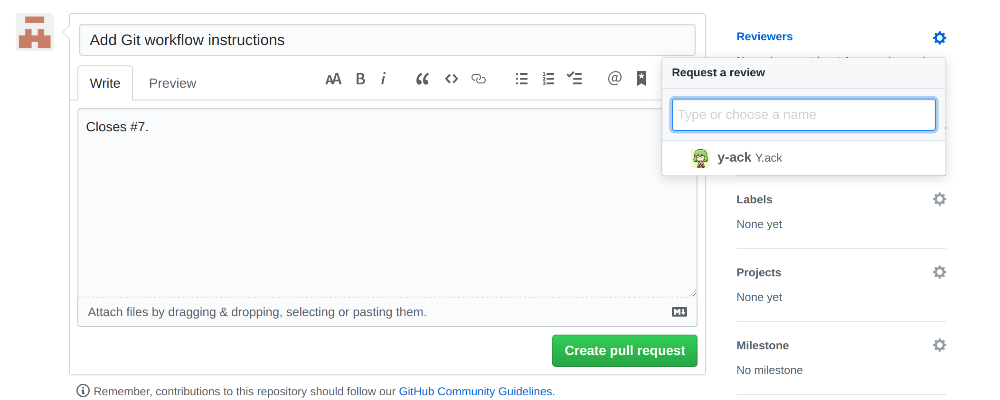

# Hint-Classifier

## Overview 

This is a model that is trained to classify problem statements from LeetCode problems based on what solution features each problem statement contains.
As of 6/11/2020, we are classifying problem statements that have the following features:

* Lists
* Sets
* Stacks
* Queues
* Priority Queues
* Maps

Problem statements are represented using [word embedding model](https://towardsdatascience.com/nlp-extract-contextualized-word-embeddings-from-bert-keras-tf-67ef29f60a7b).

### Data Gathering and Preprocessing

Relevant files: `problem.py`, `parser.py`, `problems.json`

Problem statements and solutions for each problem statement are scraped from LeetCode and stored in `statements.txt` and `solutions.txt`.
As of 6/11/2020 we currently have 763 LeetCode problem statements with corresponding solutions.

Each problem statement is then processed into a JSON object of the form: 

```
{
	number: 1,
	solutions: [
		“public int[] twoSum(int[] nums, int target) {.....”,
		“public int[] twoSum(int[] nums, int target) {.....”,
		“public int[] twoSum(int[] nums, int target) {.....”
	],
	problem_statement: “Given an array of integers, return indices of the two numbers…”
}
```

These objects are stored in `problem.json`.


### Labeling

Relevant files: `labeller.py`, `problem.json`

Labeling of problems statements is performed using `labellers.py` on `problems.json`. 
For each problem, every solution of the problem is checked to see if it has keywords that indicate if it has a feature.
These labels are stored as lists of integer values for each solution, where `0` indicates the feature is present, and `1` indicates that the feature is not present.,

These functions are called in `classifer.py`. 


### Classification

Relevant files: `embedder.py`, `classifier,py`, `modeldata.py`

#### Embedding 

For each problem statement, a word embedding (mathematical representation of words as a vector of real numbers) is created using [Google's BERT models](https://towardsdatascience.com/nlp-extract-contextualized-word-embeddings-from-bert-keras-tf-67ef29f60a7b).
The word embeddings are intended to capture the semantic meaning of each problem statement so problem statements that are semantically similar to each other will have vectors that are close to each other numerically.

The functions to perform this embedding are defined in `embedder.py` and used in `classifier.py.`

#### SVM (Support Vector Machine)

This is a type of [supervised learning model](https://en.wikipedia.org/wiki/Supervised_learning) that can be used for classification.
Support vector machines [create a hyperplane in multidimensional space](https://www.youtube.com/watch?v=3liCbRZPrZA&feature=emb_logo) to separate a dataset into classes.



An ideal choice of hyperplane will have the largest possible distance (margin) between the two points of data that are closest to the hyperplane (support vectors).

For this project, we use `scikit-learn`'s out-of-the-box [SVM classification model](https://scikit-learn.org/stable/modules/svm.html) to perform the classifications based on the problem statement labels and use [k-fold cross validation](https://en.wikipedia.org/wiki/Cross-validation_(statistics)#k-fold_cross-validation) to assess the accuracy of the model.


## Dependencies

* Python 3.8
* [SciKit Learn](https://scikit-learn.org/stable/install.html)
* [PyTorch](https://pytorch.org/get-started/locally/)
* Bert Model: `pip3 install pytorch-pretrained-bert`
* Numpy: `pip3 install numpy`

## Run Instructions

To run the classifier for all features, in the project's root directory, run `python3 src/classifier.py`. 

### Running Model for One Feature

To run the model for a specific feature, identify the corresponding `gridsearch(...)` call and comment out the others in `classifier.py`.
Then in a terminal, run `python3 src/classifier.py`.

```python3
print('\n\nOptimizing SVM hyperparameters for lists...')
gridsearch(list_labels, 10, c_range, g_range, w_range)

print('\n\nOptimizing SVM hyperparameters for sets...\n')
gridsearch(set_labels, 10, c_range, g_range, w_range)

print('\n\nOptimizing SVM hyperparameters for stacks...')
gridsearch(stack_labels, 10, c_range, g_range, w_range)

print('\n\nOptimizing SVM hyperparameters for queues...')
gridsearch(queue_labels, 10, c_range, g_range, w_range)

print('\n\nOptimizing SVM hyperparameters for priority queues...')
gridsearch(priority_queue_labels, 10, c_range, g_range, w_range)

print('\n\nOptimizing SVM hyperparameters for maps...')
gridsearch(map_labels, 10, c_range, g_range, w_range)
```

**Example: Classification for Maps**

```
Optimizing SVM hyperparameters for maps...
0.18 % positive, or 142 / 763
60 120 180 240 300 360 420 480 540 600 660 720 780 840 900 960 1020 1080 1140 1200 1260 1320 1380 1440 1500 1560 1620 1680 1740 1800 1860 1920 1980 2040 2100 2160 2220 2280 2340 2400 2460 2520 2580 2640 2700 2760 2820 2880 2940 3000 3060 3120 3180 3240 3300 3360 3420 3480 3540 3600 3660 3720 3780 3840 3900 3960 4020 4080 4140 4200 4260 4320 4380 4440 4500 4560 4620 4680 4740 4800 4860 4920 4980 5040 5100 5160 5220 5280 5340 5400 5460 5520 5580 5640 5700 5760 5820 5880 5940 6000
Accuracy: 0.8171052631578947
C = 1.0
gamma = 0.21544346900318834 weight = 0.26440677966101694
```

## Git Workflow

### Starting Work on a New Issue

1. Checkout the master branch using `git checkout master`.
2. Create a new branch off of the `master` branch using `git checkout -b <branch-name>`. Ex: `isabel/read_customers` (some name that indicates what issue it is)
3. Push a remote copy of this branch to GitHub using `git push --set-upstream origin <branch-name>`.


### Creating a Pull Request
This should be done when you have completed and tested your work on an issue branch, and you're ready to merge your changes with the `master` branch.

0. Before creating a pull request, make sure to merge any new changes from `master` into your branch using `git merge master`. Resolve any merge conflicts if any.
1. Go to the [GitHub repository](https://github.com/hollowsunsets/MovieStoreDatabase) and click on the **Pull Requests** tab.
2. Click the **New Pull Request** button.
3. Find the name of your branch in the "Example Comparisons" table and click on it.
4. Click the **Create pull request** button.

5. In the description of the pull request, write "Closes #<Issue Number>". This will associate the pull request with that issue, so when that pull request is merged, the issue will also be closed. Read more about it [here](https://help.github.com/en/github/managing-your-work-on-github/linking-a-pull-request-to-an-issue).
6. Add someone as a reviewer for the pull request.

